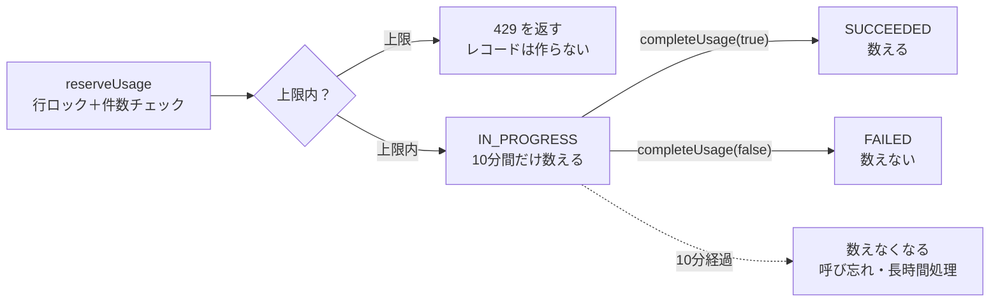

# reserveUsage / completeUsage の使い方

> 対象：分析（Engineer A）と復習の回答（Engineer B）を受け付けるサーバー処理を書く人
> ルール（上限・ウィンドウ・数え方）の根拠は [README.md](README.md) §1 を参照。この資料は「C 側の関数をどう呼ぶか」だけをまとめたもの。
> 最終更新：2026-10-05
> コードへのリンクは行番号つき。コードが変わると行がずれるので、ずれていたら関数名で探すこと。

## 要点

分析・復習の回答を受け付けるサーバー処理では、重い処理の **前に** `reserveUsage()` を呼び、終わったら **必ず** `completeUsage()` を呼ぶ。上限チェック・ウィンドウ管理・同時リクエスト対策は C 側で行うので、A/B は2つの関数を呼ぶだけでよい。

- `reserveUsage(userId, kind)`：上限を確認し、「実行中」の利用レコードを1件作ってその id を返す。上限なら `AppError` を投げる（→ 429）。
- `completeUsage(id, succeeded)`：その利用レコードを「成功」または「失敗」にする。失敗は回数に数えない。
- 実装：[usage.ts](../../apps/backend/src/service/usage.ts)

## 1. reserveUsage

[usage.ts:120](../../apps/backend/src/service/usage.ts#L120-L177)

```ts
reserveUsage(userId: string, kind: UsageKind): Promise<string>
```

上限内なら `IN_PROGRESS` の `UsageRecord` を1件作り、その id を返す。この id はあとで `completeUsage` に渡す。

| 引数 / 戻り値 | 内容 |
|---|---|
| `userId` | **内部の `User.id`**。[requireUser](../../apps/backend/src/middleware/require-user.ts#L19) の後なら `req.user!.id`。Clerk の user id（`authSubject`）ではない |
| `kind` | `"ANALYSIS"`（A：分析1回）または `"REVIEW"`（B：フォローアップ質問への回答1回） |
| 戻り値 | 作った `UsageRecord.id`（UUID） |
| 上限到達（無料） | `AppError("FREE_LIMIT_REACHED")` を投げる → 429 |
| 上限到達（Pro） | `AppError("USAGE_LIMIT_REACHED")` を投げる → 429 |

中でやっていること（呼ぶ側がやる必要はない）：

1. interactive transaction の中で `User` の行を `SELECT ... FOR UPDATE` でロックする（同じユーザーの同時リクエストを順番に処理する）。
2. 現在のプラン（FREE / PRO）を決め、必要なら新しい7日間ウィンドウを始める（初回利用・7日経過・プラン切り替え）。
3. ウィンドウ開始以降の `SUCCEEDED` と「10分以内の `IN_PROGRESS`」を数え、上限未満ならレコードを作る。

上限の値は [const.ts:3](../../apps/backend/src/lib/const.ts#L3-L6) の `LIMITS`、10分は [const.ts:10](../../apps/backend/src/lib/const.ts#L10) の `IN_PROGRESS_TIMEOUT_MS`。

## 2. completeUsage

[usage.ts:185](../../apps/backend/src/service/usage.ts#L185-L190)

```ts
completeUsage(id: string, succeeded: boolean): Promise<void>
```

`reserveUsage` が返したレコードを `SUCCEEDED`（`true`）または `FAILED`（`false`）にする。`FAILED` は回数に数えないので、ユーザーはその1回分を失わない。

| 引数 | 内容 |
|---|---|
| `id` | `reserveUsage` の戻り値 |
| `succeeded` | 処理が成功したら `true`、サーバー側の理由で失敗したら `false` |

動作の細かい点：

- `IN_PROGRESS` のレコードだけを更新する。**2回目以降の呼び出しは何もしない**（先に呼んだ結果が残る）。例：`true` のあとに `false` を呼んでも `SUCCEEDED` のまま。
- 存在しない id を渡してもエラーにならない（`updateMany` で 0 件更新）。間違った id を渡しても気づけないので注意。
- 上限エラーは投げない。投げるのは DB 障害時の Prisma エラーだけ。
- 10分を過ぎた後に呼んでも有効。`IN_PROGRESS` のままなら `SUCCEEDED` になり、もう一度回数に数えられる。

## 3. 呼び出しの流れ



上限ならレコードは作られず 429 になる。作られたレコードは `completeUsage` で `SUCCEEDED` か `FAILED` になり、呼ばれなければ10分後に数えなくなる。

実装例（A の分析。B は `"REVIEW"` に変えて回答1件ごとに同じ形）。`parseAnalysisInput` と `runAnalysis` は各自の処理の代わりである。

```ts
import { completeUsage, reserveUsage } from "../service/usage.js";

// requireUser must run before this handler (req.user is our internal User)
router.post("/analyses", async (req, res) => {
  // 1. Validate input first: a 400 must not consume a use
  const input = parseAnalysisInput(req.body);

  // 2. Reserve: throws AppError (429) when the limit is reached
  const usageId = await reserveUsage(req.user!.id, "ANALYSIS");

  let succeeded = false;
  try {
    const result = await runAnalysis(input);
    succeeded = true;
    res.json(result);
  } finally {
    // 3. Always complete: FAILED is not counted
    await completeUsage(usageId, succeeded);
  }
});
```

`try / finally` にする理由：途中で例外が出ても `completeUsage(id, false)` が呼ばれ、失敗分がすぐに枠へ戻る。例外はそのまま共通 error handler に届く。

実際に動く例として [devRoutes.ts](../../apps/backend/src/router/devRoutes.ts) も参考になる（start / complete / fail の3パターン）。

## 4. エラー処理

`reserveUsage` の上限エラーは **catch せずにそのまま投げる**。[app.ts:32](../../apps/backend/src/app.ts#L32-L47) の共通 error handler が [AppError](../../apps/backend/src/lib/errors.ts#L19-L23) を受け取り、次の JSON を返す（Express 5 なので async handler の reject も自動で届く）。

| ケース | HTTP status | `error.code` | アプリの表示 |
|---|---|---|---|
| 無料で上限 | 429 | `FREE_LIMIT_REACHED` | ペイウォール |
| Pro で上限 | 429 | `USAGE_LIMIT_REACHED` | リセットまでの時間 |
| `userId` の User がない、DB 障害 | 500 | `INTERNAL_ERROR` | 汎用エラー |

```json
{ "error": { "code": "FREE_LIMIT_REACHED", "message": "Reached free limit." } }
```

- エラーコードの一覧は [errors.ts:3](../../apps/backend/src/lib/errors.ts#L3-L10) の `ERRORS`。
- アプリ側は status ではなく `error.code` で表示を分ける（[error-handling/README.md](../error-handling/README.md)）。
- 429 を自動リトライしない。上限は数日待たないと解除されない（README §1.5）。
- 上限エラーのときはレコードが作られていないので、`completeUsage` を呼ぶ必要はない。

## 5. 注意点

- **入力チェックは `reserveUsage` の前に行う。** 400 になるリクエストで枠を予約しないため。
- **自分の `prisma.$transaction` の中で呼ばない。** `reserveUsage` は自分で transaction を開く。その後の自分の DB 書き込みが失敗しても予約は消えないので、`completeUsage(id, false)` で戻す。
- **利用レコードの id をクライアントから受け取らない。** `completeUsage` は持ち主（`userId`）を確認しない。サーバー内で保持した id だけを渡す。
- **非同期処理（ジョブ・キュー）にする場合** は、利用レコードの id を自分のテーブル（例：分析の行）に保存し、ジョブの終了時に `completeUsage` を呼ぶ。
- **10分ルール：** `IN_PROGRESS` のまま10分を過ぎたレコードは数えない。`completeUsage` を呼び忘れると、成功したのに10分後に1回分が戻る（少なく数える側にしかずれない）。また、処理が10分以上かかると、その間は上限を超えて受け付けてしまう。
- **「失敗」の定義：** 文字起こしや LLM のエラーなど、サーバー側の理由で結果を返せなかったときに `false` を使う。

## 6. 関連

- [usage.ts:28](../../apps/backend/src/service/usage.ts#L28-L88) `getUsage(userId, now)`：使用数・上限・ウィンドウ終了時刻を返す。[authRoutes.ts:13](../../apps/backend/src/router/authRoutes.ts#L13) の `GET /api/v1/me/entitlement` が使っている。上限の判定には使わず、`reserveUsage` に任せる。
- 動作確認用の開発ルート（`NODE_ENV !== "production"` のときだけ）：`POST /api/v1/dev/{analysis,review}/{start,complete,fail}`。使い方は README §6。

## 7. 未決定 / すり合わせが必要

- [ ] 分析・評価は10分以内に終わるか？超える場合はタイムアウトを見直す（A / B）
- [ ] 同じアップロードのリトライを「同じ1回」と扱うか？今はリトライごとに新しく予約される（idempotency key なし）
- [ ] `completeUsage` で `userId` も確認すべきか？（C）
